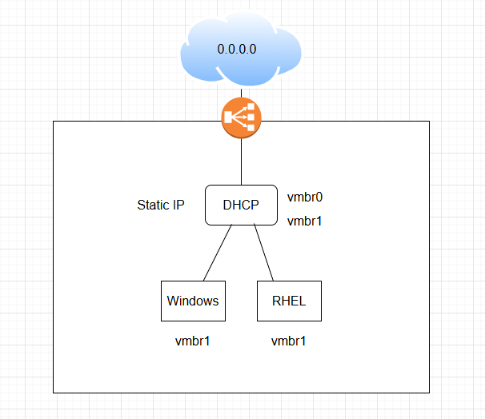

# 3주차 공통과제 - DHCP 구성

## <공통 과제>

### DHCP 서버 구축



<aside>
💡

Proxmox 안에 가상 스위치 두 개(vmbr0, vmbr1)를 만들고

그 사이에 DHCP 서버 VM 하나를 라우터처럼 두고

그 뒤에 Windows / RHEL VM을 매달아서 DHCP로 IP를 뿌리게 하자!

</aside>

- DHCP 서버 ip를 고정 IP로 해야하는 이유
    - DHCP 과정을 생각해보자..
    - vmbr0은 집 공유기가 DHCP 서버인셈 ㅇㅇ
    - 내부망에서는 VM들이 DHCP Discover 요청을 보내면 받아줄 DHCP 서버 VM이 없다
    - 그래서 DHCP 서버에 IP를 정적으로 수동으로 넣어줘야댐

- NIC (ex.`enp3s0`) → 물리 NIC
    - NIC (network Interface card)
    - 리눅스는 NIC 마다 이름이 있어야 한다. 
    옛날에는 `eth0`, `eth1`이였지만 요즘은 `enp3s0`, `eno1` 등 이라고 한다.
- vmbr0/ vmbr1 → 논리 NIC
    
    ```c
    [물리 머신 (host)]
      └─ Proxmox 하이퍼바이저
            ├─ 물리 NIC: enp3s0  ← 진짜 랜카드
            ├─ 브릿지: vmbr0    ← enp3s0에 붙은 가상 스위치 (외부망)
            ├─ 브릿지: vmbr1    ← 내부 전용 가상 스위치
            └─ VM들 (guest)
                  ├─ VM1 NIC → vmbr0에 꽂힘
                  ├─ VM1 NIC → vmbr1에 꽂힘
                  └─ VM2 NIC → vmbr1에 꽂힘
    ```
    
    가상 스위치(브릿지) ㅡ 마치 enp3s0 랜선을 연결한 **공유기(스위치)** 인셈
    
    Proxmox에서는 보통 **vmbr0**에 `enp3s0` 같은 물리 NIC를 연결해 둠
    
    - bridge_ports=enp3s0
    - IP address
    - gateway
    - route table
    
    **vmbr1**는 위 같은 요소를 설정 안 했으므로, 내부 전용 스위치 (인터넷 안 됨) 
    → 물리 NIC 안 달고, 오직 VM들만 붙음
    

### vmbr1 브릿지 만들기

`vmbr0` = 외부망, `vmbr1` = 내부 가상망


vmbr0


vmbr1
(110.10.10.0/24 대역 사용 + 해당 대역의 끝주소 사용)

보통 호스트는 끝번호를 사용한다고 한다..

### DHCP 라우터 VM 만들기


서버 우분투 VM을 DHCP 서버로 쓰기로 했다. OpenSSH 서버도 설치해줬다..

 vmbr0만 붙어있어서 vmbr1도 붙여줬다


`ip addr` 


**ens18** (vmbr0 외부망이랑 연결된 애)

- DHCP로 IP 받음 → `172.30.1.45`
- UP

**ens19** (vmbr1 내부망이랑 연결된 애)

- ip 없음
- DOWN 상태

### DHCP 고정 IP 설정하기

리눅스의 NIC 설정을 하나의 YAML로 정의하는 시스템 **netplan** 수정하자


**`dhcp4: false`**

ens19는 DHCP(울집 공유기)에서 주소 받지 말고, 내가 수동으로 설정한 주소를 사용해라 라는 뜻..


이제 ens19에 내가 정적 할당한 10.10.10.1/24 가 보인다!

### DHCP 서버 설치하기

`sudo apt install isc-dhcp-server -y` 명령어로 설치 해주고..

`/etc/default**/isc-dhcp-server**` 파일에서 INTERFACESv4="ens19" 이렇게 설정해준다

== 내가 설정하는 이 DHCP에서는 ens19 (내부망) 에만 뿌리게 하거라

집 공유기 망에다가 내가 설정한 DHCP 패킷을 뿌리면 안되니까.. 내부망으로만 뿌리도록..


`/etc/dhcp/dhcpd.conf` : DHCP 정책 파일

```c
subnet 10.10.10.0 netmask 255.255.255.0 {
    range 10.10.10.50 10.10.10.100;
    option routers 10.10.10.1;
    option domain-name-servers 8.8.8.8;
}
```

- 내부망은 10.10.10.0/24를 사용하고
- DHCP 클라이언트 할당 범위는 50~100로 설정
- DHCP 서버(라우터)는 10.10.10.1 설정
- DNS 설정 - “나의 내부 클라이언트들은 도메인 → IP 변환할 때 8.8.8.8한테 물어봐라”
    - DNS는 ip를 직접 쓰는 통신들이랑은 관계 없지만, 없으면 apt update 같은 인터넷 쓰는 요청들이 목적지 ip를 알아내지 못해서 오류난다.

### 클라이언트 VM 두 개 만들기

같은 브릿지(vmbr1)에 꽂힌 애들(IP 포함)은 전부 같은 네트워크(10.10.10.0/24) 안에 있어야 한다.

RHEL/Rocky VM


- 어 왜 ip는 10.10.10.50(내부망)인데 왜 브릿지가 ens18이지? (ens18은 외부망 vmbr0거 아니였어?)
    
    Proxmox 입장에서
    
    - **vmbr0** → 외부망 브리지 (enp3s0 물리 NIC에 붙어있음)
    - **vmbr1** → 내부망 브리지 (물리 NIC 없음, 순수 내부 스위치)
    
    VM 연결 ㅡ 같은 vmbr1에 붙어 있고, 같은 10.10.10.0/24 대역을 쓴다
    
    - **DHCP 라우터 VM**
        - ens18 ↔ vmbr0
        - ens19 ↔ vmbr1
    - **Windows 클라 VM**
        - ens18 ↔ vmbr1
    - **RHEL 클라 VM**
        - ens18 ↔ vmbr1
    
    게스트 OS 안에서의 NIC(ens18/19) 이름은 VM마다 따로인거구나.. (그 VM에서 몇 번째 NIC냐 라는 단순 순번 이름)
    

Windows Server 2016 VM


윈도우 뭐지.. VirtIO 드라이버를 기본으로 포함하고 있지 않다고 한다

- VM은 실제 물리 리소스를 쓰는게 아니라, 하이퍼바이저가 제공하는 특수 가상 장치를 사용하는데 VirtIO라는 가상 하드웨어 드라이버 규격이 필요하다
- 윈도우는 Hyper-V 기준으로 설계돼서 KVM/Proxmox 전용 VirtIO 드라이버를 안넣어줫다

virtio-win.iso 을 따로 다운받았다.. 

OS 받고 네트워크 어댑터도 다시 잡아줬다


오 10.10.10.51 주소를 받았다 게이트웨이는 DHCP 고정 IP 이당 

- DHCP 설정할 때 DNS만 설정하고 DNS search domain 지정을 안해서 [example.org](http://example.org) 로 뜨는구나


**ping 테스트**


Windows → RHEL (O)

- 리눅스는 기본적으로 ICMP를 허용한다고 한다

RHEL →  Windows  (X)

- `ping`은 ICMP 라는 걸 쓰는데, 
Windows 방화벽은 기본적으로 ICMP Echo Request (ping 요청) 차단