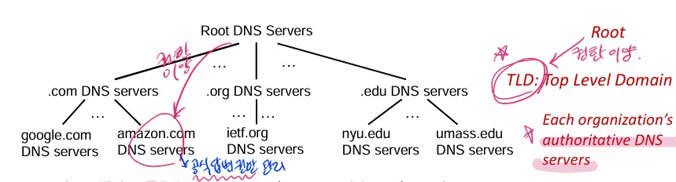

# 4주차 공통과제 - DNS

## 이론

### DNS의 핵심 역할과 구분

**Public DNS** : 인터넷 상의 모든 사용자가 접근 가능한 도메인(예: [google.com](http://google.com/), [naver.com](http://naver.com/))을 해석합니다. 보통 ISP나 구글(8.8.8.8) 등이 제공한다. 

**Private DNS** : 외부에 공개되지 않은, 내부 네트워크에서만 사용되는 도메인 (예: interanetcompany, [babo.com](http://babo.com) 등) for 보안 및 내부망 관리

### DNS Forwarding

- 표준 DNS 계층 구조
    
    
    
    - **Root (.)**: 모든 도메인의 시작점.
    - **TLD (.com, .org)**: 최상위 도메인 관리자. `google.com`이 어디 있는지 알고 있음.
    - **Authoritative DNS (google.com)**: **"공식 답변을 줄 수 있는 서버"**. 실제 IP 주소(최종 정답)를 가지고 있음.
    
    상위 기관(Root/TLD)이 하위 기관(Authoritative)에게 "네가 관리해"라고 권한 이양(Delegation)을 해주는 구조.
    
- DNS가 도메인을 IP로 변환하는 과정 - DNS Query
    
    ### Recursive Query (재귀적 질의)
    
    - **정의:** 클라이언트가 DNS 서버에게 요청을 보낼 때, 
    "과정은 네가 알아서 처리하고, 나에게는 최종 결과(IP 주소)만 달라"고 요청하는 방식
    - **주체:** 주로 PC/스마트폰(Stub Resolver)이 **로컬 DNS 서버**에게 요청할 때 사용.
    - **특징:** 클라이언트는 복잡한 과정을 거치지 않고 단순 대기. 
    만약 DNS 서버가 답을 모르면, DNS 서버가 대신 다른 서버들을 찾아다닌다.
    
    ⇒ Forwarding은 Recursive Query를 사용
    
    ### Iterative Query (반복적 질의)
    
    - **정의:** DNS 서버가 다른 DNS 서버(Root, TLD 등)에게 요청을 보낼 때, "답을 모르면, 답을 알 만한 다음 서버라도 알려달라"고 요청하는 방식입니다.
    - **주체:** 로컬 DNS 서버(Recursive Resolver)가 **Root, TLD, Authoritative Server**를 차례대로 방문할 때 사용됩니다.
    - **특징:**
        1. Root에게 질문 → 나 몰라, .com(TLD)에게 가봐.
        2. TLD에게 질문 → " 몰라, google.com(Auth)에게 가봐.
        3. Auth에게 질문 → 여기 IP(1.2.3.4) 있어. (최종 해결)
        

DNS 서버가 클라이언트로부터 받은 쿼리(질의)를 직접 처리(Root부터 찾는 Iterative 방식)하지 않고, **사전에 지정된 다른 DNS 서버(Forwarder)에게 쿼리를 그대로 토스하여 대신 처리하게 하는 기술**

- 일반적인 상황 (Iterative 방식) : 질의를 받은 내가 root부터 다 뒤져서 auth DNS를 찾아올게
- Forwarding : 나 몰라서 저기 있는 8.8.8.8 이나 사설 서버한테 물어보고 알려줄게
    - Global Forwarding : 자신이 처리 못 하는 모든 요청을 특정 서버(ex. 8.8.8.8)으로 넘기기
    - **Conditional Forwarding** : 특정 도메인에 대한 요청만, 특정 서버로 넘기고 나머지는 자기가 처리하거나 인터넷으로 보낸다

    <장점>
- **보안 강화** : 내부망 (Private DNS) 정보를 인터넷에 노출하지 않아도 됨
- **네트워크 분리 및 관리** : 인터넷용 도메인과 사내용 도메인을 관리하는 서버를 분리가능
    - 외부 DNS는 인터넷만 처리하고, 사내 도메인 요청이 올 때만 내부 DNS로 넘겨주어서 트래픽을 효율적으로 분리할 수 있게 됨
- **성능 향상 및 캐싱** : Forwarder가 이미 답을 알고 있다면 (캐시), 하위 서버는 root부터 찾을 필요가 없다
- DNS 포워딩은 언제 사용될까? 예시들
    
    ### Case 1: 하이브리드 클라우드 / VPN 환경
    
    - **상황:** 회사가 AWS(클라우드)와 온프레미스(사무실)를 VPN으로 연결했습니다.
    - **문제:** 사무실 PC에서 클라우드 내부 서버(`db.aws.internal`)를 찾을 수 없습니다. (인터넷에는 없는 주소니까)
    - **해결:** 사무실 DNS 서버에 "aws.internal 로 끝나는 건 AWS 쪽 DNS 서버로 포워딩해라"라고 설정합니다.
    
    ### Case 2: ISP(인터넷 제공자)의 DNS 운용
    
    - **상황:** SK, KT, LG 같은 통신사 DNS.
    - **사용:** 가입자들의 수많은 요청을 받으면, 직접 다 찾지 않고 상위의 더 큰 캐시 서버로 **포워딩**하여 트래픽을 분산하고 속도를 높입니다.
    
    ### Case 3: Active Directory (AD) 환경
    
    - **상황:** 윈도우 서버(AD)를 쓰는 기업.
    - **사용:** 사내 PC들은 AD 도메인(`corp.company.local`)을 찾아야 합니다. 일반 인터넷 DNS(8.8.8.8)는 이걸 모릅니다.
    - **해결:** 사내 DNS를 구축하고, PC들은 사내 DNS를 바라보게 합니다. 사내 DNS는 `company.local`은 자기가 처리하고, 나머지(`naver.com`)는 외부로 **포워딩**합니다.

### Traffic Flow

| **구분** | **일반적인 인터넷 접속 (google.com)** | **본 실습의 접속 (BABO.com)** |
| --- | --- | --- |
| **1단계** | Client → Local DNS (Recursive) | Client → Public DNS (Recursive) |
| **2단계** | Local DNS → **Root/TLD/Auth (Iterative)** | Public DNS → **Private DNS (Forwarding)** |
| **3단계** | 전 세계 DNS 계층을 순차 탐색 | 지정된 사설 서버로 **즉시 점프** |
| **결과** | 공인 IP 획득 | 사설망 내부 IP 획득 |


### 실습 아키텍처 및 목표


| **역할** | **호스트명** | **IP 주소** | **주요 서비스** | **비고** |
| --- | --- | --- | --- | --- |
| **Client** | Win/Ubuntu Desktop | `10.0.2.15` | Browser, CLI | DNS를 **10.0.2.16**으로 설정 |
| **Public DNS** | Ubuntu Server 2 | `10.0.2.16` | **Native BIND9**, Nginx | 외부망 쿼리 처리 + Private 도메인 포워딩 |
| **Private DNS** | Ubuntu Server 1 | `10.0.2.17` | **Docker BIND9**, Apache | `BABO1.com`, `BABO2.com`의 원본 데이터 보유 |

### 도메인별 매핑 목표

- `www.google.com` → 외부 인터넷 IP (8.8.8.8 경유)
- `www.BABO1.com` → `10.0.2.16` (Nginx가 실행 중인 Public DNS 서버)
- `www.BABO2.com` → `10.0.2.17` (Apache가 실행 중인 Private DNS 서버)

---

## 실습

### 네트워크 및 웹 서버 기초 설정

- **VM 생성**


- **기초 패키지 설치:** `bind9`, `net-tools` 등 설치

```c
# 1. 패키지 목록 업데이트
sudo apt update

# 2. 필수 도구 설치 (한 줄로 끝내기)
# bind9: DNS 서버 프로그램 (둘 다 써야 함)
# net-tools: ifconfig 등 네트워크 확인용
# qemu-guest-agent: Proxmox에서 IP 보이게 하는 용도
# unzip: 나중에 필요할 수도 있음
sudo apt install bind9 net-tools qemu-guest-agent unzip -y
```

- **clone 복제**


- **Public DNS 서버에 Nginx 설치**
    
    ```c
    # Nginx 설치
    sudo apt update
    sudo apt install nginx -y
    
    # 설치 확인 (Active: running 확인)
    systemctl status nginx
    ```
    
    
    

DNS 서버는 **고정 IP**여야 한다! - 클라이언트 설정 파일에서 DNS 서버를 딱 적어줘야 한다

- 고정 IP 설정 (10.10.2.16/24)
    
    `sudo nano /etc/netplan/00-installer-config.yaml`
    
    귀찮아서 확인을 안했는디 병욱쌤은 아마 저 부분 DNS 서버 지정을 127.0.0.1로 두신 것 같다
    (그래서 Public DNS에서 nslookup만 해도 잘 나오신듯!! ㅠ 나는 nslookup 할 때 내 자신한테 물어보라고 지정을 안 하면 진짜 인터넷에 있는 [BABO1.com](http://BABO1.com) 의 IP가 나와버림 ㅋㅋ!!!!)
    
    ```c
    network:
      version: 2
      renderer: networkd
      ethernets:
        ens18:
          dhcp4: no
          addresses:
            - 10.0.2.16/24
          routes:
            - to: default
              via: 10.0.2.1
          **nameservers:
            addresses:
              - 8.8.8.8**
    ```
    
    `sudo netplan apply`
    
    
    

- **Private 서버에 apache 랑 Docker 설치**
    
    ```c
    # Apache 및 Docker 설치
    sudo apt update
    sudo apt install apache2 docker.io -y
    
    # 설치 확인
    systemctl status apache2
    # (Docker도 확인)
    systemctl status docker
    ```
    
    
    
- **고정 IP 설정**
    
    `sudo nano /etc/netplan/00-installer-config.yaml`
    
    ```c
    network:
      version: 2
      renderer: networkd
      ethernets:
        ens18:
          dhcp4: no
          addresses:
            - 10.0.2.17/24
          routes:
            - to: default
              via: 10.0.2.1
          nameservers:
            addresses:
              - 8.8.8.8
    ```
    
    `sudo netplan apply`
    
    
    

### Private DNS 구축 (Ubuntu Server 1 - Docker)

이 서버는 BABO 도메인의 Authoriative Source를 갖는다

- **작업 디렉토리 생성**
    
    `mkdir -p ~/mybind9/zones`
    
- **설정 파일 작성**
    - `named.conf.options`: Forwarders에 `8.8.8.8` (인터넷 연결용)
        
        ```c
        options {
            directory "/var/cache/bind";
            recursion yes;
            allow-query { any; };
            listen-on { any; };
            listen-on-v6 { any; };
            forwarders { 8.8.8.8; };
            dnssec-validation no;
        };
        ```
        
    - `named.conf.local`: [`BABO1.com`](http://BABO1.com) , [`BABO2.com`](http://BABO2.com)  Zone 선언.
        
        ```c
        zone "BABO1.com" { type master; file "/etc/bind/zones/db.BABO1.com"; };
        zone "BABO2.com" { type master; file "/etc/bind/zones/db.BABO2.com"; };
        ```
        
    - `zones/db.BABO1.com`: A 레코드 `www` -> `10.0.2.16`
        
        ```c
        $TTL 86400
        @ IN SOA ns.BABO1.com. admin.BABO1.com. ( 2025022701 3600 1800 604800 86400 )
        @ IN NS ns.BABO1.com.
        ns IN A 10.0.2.17
        www IN A 10.0.2.16
        ```
        
    - `zones/db.BABO2.com`: A 레코드 `www` -> `10.0.2.17`
        
        ```c
        $TTL 86400
        @ IN SOA ns.BABO2.com. admin.BABO2.com. ( 2025022701 3600 1800 604800 86400 )
        @ IN NS ns.BABO2.com.
        ns IN A 10.0.2.17
        www IN A 10.0.2.17
        ```
        
- **Dockerfile 작성 및 빌드**
    
    ```c
    FROM ubuntu:latest
    RUN apt-get update && apt-get install -y bind9 dnsutils && apt-get clean
    ENV PATH="/usr/sbin:${PATH}"
    RUN mkdir -p /etc/bind/zones
    COPY named.conf.options /etc/bind/named.conf.options
    COPY named.conf.local   /etc/bind/named.conf.local
    COPY zones/db.BABO1.com       /etc/bind/zones/db.BABO1.com
    COPY zones/db.BABO2.com       /etc/bind/zones/db.BABO2.com
    EXPOSE 53/tcp
    EXPOSE 53/udp
    CMD ["/usr/sbin/named", "-c", "/etc/bind/named.conf", "-g"]
    ```
    
    `sudo docker build -t mybind9 .`
    

- **컨테이너 실행** (주의: 호스트 53 포트 확보)
    
    ```c
    # 네이티브 bind9 서비스 중지 (쟤가 53 포트 사용중이라..)
    sudo systemctl stop bind9
    sudo systemctl disable bind
    
    # 컨테이너 실행
    docker run -d --name bind9 -p 53:53/tcp -p 53:53/udp mybind9
    ```
    


### Public DNS 구축 (Ubuntu Server 2 - Native)

이 서버는 클라이언트가 직접 바라보는 DNS이고, 모르는 주소를 Server1로 넘긴다

모르는건 구글(8.8.8.8)로 넘기고, BABO를 물어보면 Server1에게 forwarding 설정!!!!

- **BIND9 설치**
    
    `sudo apt install bind9`
    
- **일반 옵션 설정 (세상 모든 질문은 구글한테 물어보삼)**
    
    `sudo nano /etc/bind/named.conf.options`
    
    ```c
    options {
        directory "/var/cache/bind";
    
        // 1. 재귀 질의 허용 (손님이 "답만 줘!" 하면 들어줌)
        recursion yes;
    
        // 2. 아무나 나한테 물어볼 수 있음 (Client 접속 허용)
        allow-query { any; };
    
        // 3. 모르는 건 다 구글(8.8.8.8)한테 물어봄
        forwarders {
            8.8.8.8;
        };
    
        // 4. 보안 설정 (실습이라 끔)
        dnssec-validation no;
    
        // 5. IPv6 에러 방지
        listen-on-v6 { any; };
    };
    ```
    
- **Forwarding 설정**
    
    `sudo nano /etc/bind/named.conf.local`
    
    ```c
    // BABO1.com 질문이 오면 -> 10.0.2.17 (Server 1)로 던져라!
    zone "BABO1.com" {
        type forward;
        forwarders { 10.0.2.17; };
    };
    
    // BABO2.com 질문이 오면 -> 10.0.2.17 (Server 1)로 던져라!
    zone "BABO2.com" {
        type forward;
        forwarders { 10.0.2.17; };
    };
    ```
    
- **서비스 재시작:** `sudo systemctl restart bind9`
    
    
    

- **nslookup으로 포워딩 잘됐나 테스트**


`nslookup [www.google.com](http://www.google.com/) 127.0.0.1`

- 지금 10.0.2.16 으로 정적 IP 할당 해줘서 인터넷 안됨

`nslookup www.BABO1.com 127.0.0.1` 

```c
Non-authoritative answer:
Name: www.BABO1.com
Address: 10.0.2.16
```

- 나 자신(Public DNS)한테 [BABO1.com](http://BABO1.com) 아냐고 물어봄 (지정해줘야됨..)
- 나는 non-auth 이다. (auth server는 Public DNS니까) 글고 아까 물어본 도메인의 IP는 10.0.2.16이다!!
    - Private DNS에 `zones/db.BABO1.com`: A 레코드 `www` -> `10.0.2.16` 설정 해놨었음
    
    
    

### 클라이언트 설정 및 최종 테스트

DHCP 실습 때 썼던 윈도우 서버(10.10.10.51 할당받았던) 를 클라이언트로 사용하기로 했다

중간에 핑이 안가서 왜지 했는데 얘가 vmbr1이고 DNS 서버는 vmbr0으로 만들었어서…

- **Client (10.0.2.15)로 설정하고, DNS 설정:**
    - `/etc/resolv.conf` (또는 네트워크 설정)에서 
    Nameserver를 **`10.0.2.16` (Public DNS)** 단 하나만 설정.
    - 핑 테스트 (네트워크 브릿지 바꾸기 전과 후)
    
    
    

- **연결 테스트:**
    - `nslookup www.google.com` -> IP가 잘 뜨는지 (외부망)
        
        
        
        - 안됨!! 내가 10.0.2.15 로 설정했으니
        
    - `nslookup www.BABO1.com` -> `10.0.2.16`이 뜨는지 (Forwarding 동작 확인)
        - 클라이언트가 Public DNS한테 물어봄 (10.0.2.16)
        - Non-auth (당연함 Public DNS는 auth가 아님) answer
            - **Server 2에서 Server 1로 포워딩**을 시켰음 확인
            - “BABO1 은 10.0.2.16(Server2)이다” ⇒ 맞음 server2에 nginx를 깔았었음
    - `nslookup www.BABO2.com` -> `10.0.2.17`이 뜨는지
        - 클라이언트가 Public DNS를 잘 찾아감
        - Server 2가 Server1한테 질문을 잘 Forwarding 했음
        - Server1이 올바른 IP (10.0.2.17)를 알려줌 ⇒ 맞지 server1에 apache 깔았었음


---

### DNS 서버 지정 vs DNS 포워딩

**DNS 서버 지정 (Netplan 설정)**

- 주체 : 우분투 운영체제
- 내가 apt install 이나 ping 같은 거 할 때 누구한테 물어볼까
- 나는 8.8.8.8로 설정함
    - 그래서 nslookup ~~ 127.0.0.1 안 해주면 인터넷한테 물어봄!!

**DNS 포워딩 (BIND9 설정)**

- 주체 :  BIND9 프로그램 (따로 설치한 서버 앱)
- named.conf에 포워딩 설정 : 지정한 클라이언트 (지금은 any로 했지만)가 지정한 도메인을 물어보면 server1로 토스

### Reverse Zone 설정

**“Server Unknown” 으로 보임!!**

왜냐면 zone [db.BABO1.com](http://db.babo1.com/) 파일 만들 때 서버 이름표(PTR 레코드) 안 만들음 !!

### 인터넷 안 되는 이유 예상ㅠㅠ : VirtualBox vs Proxmox

VirtualBox NAT 

- `10.0.2.x`라는 **가짜 IP**를 쓰지만, 인터넷이 잘 된다. 왜냐면 VirtualBox가 중간에서 10.x.x.x 를 192.168.x.x 로 NAT 변환을 시켜준다!!  ip 세탁을 시켜줌

Proxmox vmbr0 

- 우리집 공유기랑 vmbr0이 연결은 돼있는데 울집 공유기 대역이랑 10.x.x.x 이 다르니까 공유기가 인터넷에 통과를 안시켜줌!!

---

이것도 저번주 못햇던거랑 같이 시험 끝나고 복습겸 해봐야겠음!!!! ㅠㅠ 꼭 할거임

### 와이어샤크 패킷 분석